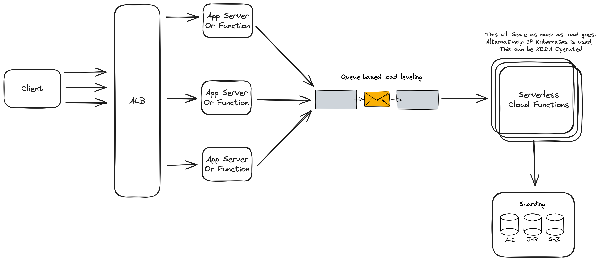

# Scaling

## Question: How would you help scale this process to write 100,000 claims per second?

## Answer

Scaling a system to handle 100,000 writes per second is a complex task that typically involves a combination of application and infrastructure changes. Here is a high-level approach:

- Load Balancing: Distribute incoming traffic across multiple instances of the application using a load balancer.
- Microservices: Break down the application into microservices to allow scaling of individual components as needed.
- Message Queues: Utilize message queues like Kafka or RabbitMQ to absorb bursts of traffic and ensure reliable data transfer between microservices.
- Database Sharding: Partition the database into multiple shards to spread the load across several servers or clusters.
- Database Optimization: Utilize a high-performance database setup that can handle high write loads, like Amazon Aurora or a NoSQL solution (DynamoDB or CosmosDB) when appropriate.
- Write Optimization: Batch inserts to the database to reduce the number of write operations.
- Stateless Services: Make sure the services are stateless so they can be easily scaled horizontally.
- Cloud Services: Consider using cloud-managed services for databases, caches, and queues, which can offer better scalability options.

### Diagram

